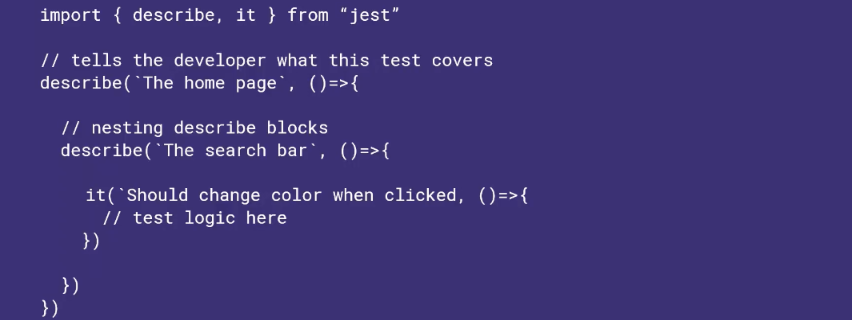
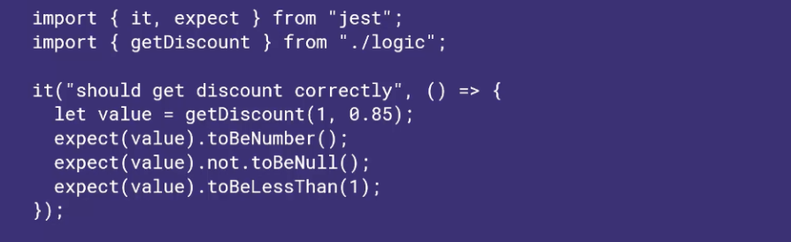
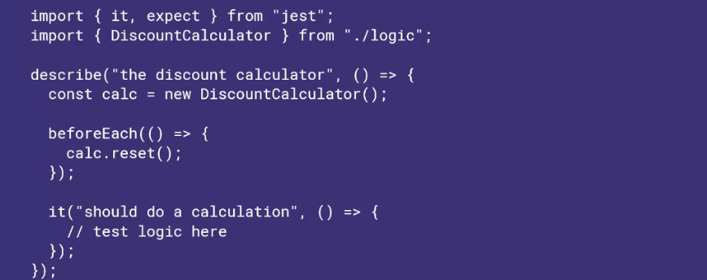
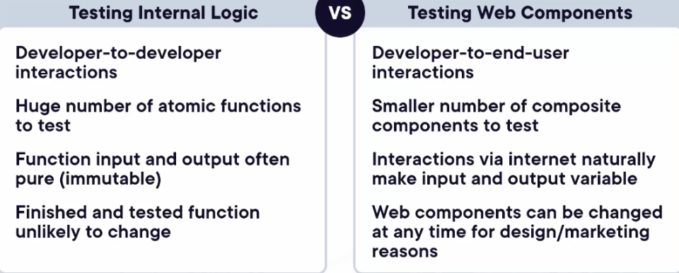

# Unit Tests with Jest
## Understanding Jest API
- Describe/Suite 
	- Used to organize and group together tests
	- Can be nested
	

- It/Test: Individual testing
- Expect (Assert)
	- Each test should have at least a few expectations (assertions)
	- Tests fail if any assertions do not work as expected
	- Matches a variable or component to an expected state
	

- Before/After
	- Runs cleanup.setup logic
	- Occurs before/after each test
	- Necessary to execute UI tests
	
		- Calls calc.reset each time before test runs (which removes repeating)

## Application Logic
- Application Logic is not external libraries, not declarative (ie. package.json), and not components (like React)
- Example of Application Logic: Currency Converter, Password validator, etc.
- Principles for Testing Application Logic
	- Focus on inputs and outputs of immutable functions
	- Cover all possible corner cases
	- Keep test logic simple

## Mocks
- Testing code, when not being able to adjust base code
- When to use mocks: Async effects, HTTP calls, Filesystem read/write, Random effects

## Testing Internal Logic vs Testing Web Components

## Principles of Testing Web Components
- Test critical interactions and use libraries to virtualize browser environment
	- Testing libraries virtualize the DOM allowing streamlined testing
- Snapshots Tests: Breaks if anything changes (including styles) and automatically captures HTML output of components
	- .toMatchShapshot()
